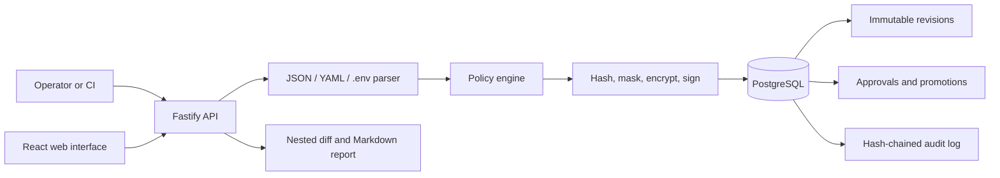

# Configuration Governance Service

[](https://github.com/German4341374/configuration-governance-service/actions/workflows/ci.yml)
[](LICENSE)

Configuration Governance Service is a compact control plane for reviewing configuration changes
before they reach development, staging, or production. It accepts JSON, YAML, and `.env` input,
creates immutable revisions, enforces environment-aware policies, separates approval from authoring,
and records activation, promotion, and rollback in a tamper-evident audit chain.

The project demonstrates TypeScript backend and frontend development, PostgreSQL transactions,
optimistic concurrency, encryption, policy-as-code, Docker, testing, and CI/CD without requiring a
cloud account.

## Features

- Immutable configuration revisions with deterministic SHA-256 content hashes.
- Duplicate upload protection per environment.
- JSON, YAML, and `.env` parsing with strict input limits.
- Nested structural diff with added, removed, changed, and type-changed entries.
- Required fields, type rules, forbidden values, naming rules, timeout limits, TLS enforcement,
  production host restrictions, and forbidden debug flags.
- Append-only approvals with author/reviewer separation of duties.
- Optimistic concurrency through environment `lockVersion` values.
- Controlled `development -> staging -> production` promotion.
- Rollback by moving the active pointer to a previously active immutable revision.
- Recursive secret masking plus AES-256-GCM encrypted storage.
- Optional HMAC-SHA256 revision manifests.
- Hash-chained audit records with a verification endpoint.
- Read-only revision views, status dashboard, audit view, Markdown reports, and a responsive React UI.
- CI validation mode with documented exit codes.

## Architecture



The service stores encrypted canonical configuration content for promotion, and a separately
redacted document for every API response and diff. PostgreSQL transactions keep revisions,
environment pointer changes, promotion history, and audit entries consistent.

See [architecture](docs/architecture.md), [policies](docs/policies.md),
[permissions](docs/permissions.md), [rollback semantics](docs/rollback-and-promotions.md), and
[security and audit guarantees](docs/security-and-audit.md).

## Technology stack

- Node.js 24 LTS and TypeScript strict mode
- Fastify 5
- React 19 and Vite 8
- PostgreSQL 18
- Zod and YAML
- Vitest, ESLint, Prettier, and V8 coverage
- Multi-stage Docker build and Docker Compose
- GitHub Actions and Dependabot

## Quick start with Docker

Prerequisites: Git, Node.js 24+, npm 11+, and Docker with Compose v2. Linux and WSL2 are supported.

```bash
git clone https://github.com/German4341374/configuration-governance-service.git
cd configuration-governance-service
npm run setup
docker compose up --build -d --wait
```

`npm run setup` installs the locked dependencies and creates an ignored `.env` with random local
credentials and encryption/signing keys. It never overwrites an existing `.env`.

Open <http://127.0.0.1:8080>. Stop the stack with:

```bash
docker compose down
```

Remove local database state only when it is safe to do so:

```bash
docker compose down --volumes
```

## Local development

Start PostgreSQL, migrate the database, and run the API:

```bash
npm run setup
docker compose up -d postgres
npm run migrate
npm run dev
```

In another terminal, run the Vite development server:

```bash
npm run dev:web
```

The UI is then available at <http://127.0.0.1:5173>; Vite proxies API calls to port 8080.

## API overview

| Method | Endpoint                             | Permission | Purpose                                                    |
| ------ | ------------------------------------ | ---------- | ---------------------------------------------------------- |
| `POST` | `/api/revisions`                     | upload     | Parse, validate, hash, mask, encrypt, and store a revision |
| `GET`  | `/api/revisions`                     | read       | List redacted revision metadata                            |
| `GET`  | `/api/revisions/:id`                 | read       | Read one redacted revision                                 |
| `POST` | `/api/revisions/:id/decisions`       | approve    | Approve or reject                                          |
| `GET`  | `/api/diff?from=&to=`                | read       | Nested redacted diff                                       |
| `GET`  | `/api/revisions/:id/report.md`       | read       | Export a Markdown report                                   |
| `GET`  | `/api/revisions/:id/manifest`        | read       | Read hash and optional signature                           |
| `POST` | `/api/environments/:name/activate`   | deploy     | Activate an approved same-environment revision             |
| `POST` | `/api/environments/:name/promotions` | deploy     | Promote from the previous environment                      |
| `POST` | `/api/environments/:name/rollback`   | deploy     | Restore a previously active revision                       |
| `GET`  | `/api/audit`                         | read       | Read audit entries                                         |
| `GET`  | `/api/audit/verify`                  | read       | Verify the complete hash chain                             |
| `GET`  | `/health/live`                       | public     | Process liveness                                           |
| `GET`  | `/health/ready`                      | public     | PostgreSQL readiness                                       |

The local `demo` authentication mode accepts `X-Actor` and `X-Role`, but defaults to
`demo-admin/admin` for the browser. Production refuses to start in demo mode; configure
`AUTH_MODE=trusted_headers` and supply identity headers from an authenticated reverse proxy.

### Upload example

```bash
curl --fail http://127.0.0.1:8080/api/revisions \
  -H 'content-type: application/json' \
  -H 'x-actor: config-author' \
  -H 'x-role: editor' \
  --data-binary @- <<'JSON'
{
  "environment": "development",
  "format": "yaml",
  "content": "app:\n  name: support-api\n  debug: false\nserver:\n  timeoutMs: 5000\ntransport:\n  tls:\n    enabled: true"
}
JSON
```

API errors have one shape:

```json
{
  "error": {
    "code": "VERSION_CONFLICT",
    "message": "Environment was changed by another request",
    "requestId": "req-1",
    "details": { "expectedVersion": 2, "currentVersion": 3 }
  }
}
```

## CI policy mode

Validation does not require PostgreSQL:

```bash
npm run cli -- validate \
  --file examples/production.yaml \
  --environment production \
  --report reports/production.md
```

Exit codes are stable for pipeline use:

- `0`: parsed successfully and all policies passed.
- `2`: parsed successfully but at least one policy failed.
- `3`: command, input, format, or policy file error.

The report contains only paths, rule results, and the content hash; it never includes values from
secret paths.

## Testing and verification

```bash
npm run format:check
npm run lint
npm run typecheck
npm run test:coverage
npm run build
npm audit --omit=dev --audit-level=high
```

Set `TEST_DATABASE_URL` to run the PostgreSQL integration suite. GitHub Actions provides a clean
PostgreSQL service, executes the full API workflow, builds the container, and runs
`scripts/demo.sh` against the Compose stack.

## Security considerations

- API output and diffs use only recursively redacted content.
- Canonical plaintext is encrypted using AES-256-GCM with a unique nonce for each revision.
- Encryption and signing keys come only from environment variables and are never committed.
- Secret-key patterns include passwords, tokens, API keys, private keys, credentials, and
  connection strings.
- Signed manifests are optional integrity evidence, not an identity or authorization mechanism.
- Revision authors cannot approve their own changes.
- Production requires trusted identity headers and should be placed behind TLS and an authenticating
  reverse proxy that strips client-supplied identity headers.
- Audit chaining detects modification, deletion, and reordering when an external checkpoint of the
  latest hash is retained. It does not make a compromised database physically immutable.

Read the complete [security model](docs/security-and-audit.md) and report vulnerabilities according
to [SECURITY.md](SECURITY.md).

## Development and production differences

Development uses `AUTH_MODE=demo`, loopback-bound Compose ports, generated local keys, and an
optional Vite development server. Production requires `NODE_ENV=production`,
`AUTH_MODE=trusted_headers`, externally managed keys, TLS termination, database backups, restricted
network access, and an external audit-hash checkpoint. The included Compose file is a local
demonstration environment, not a high-availability production deployment.

## Limitations

- No built-in user directory, SSO, or long-lived sessions; identity is delegated to a trusted proxy.
- Policies are loaded from one startup YAML file and require a restart to change.
- `.env` values remain strings, so type rules must reflect string semantics for that format.
- Secret detection is key-name based and cannot identify arbitrary sensitive values with neutral names.
- No distributed lock or leader election; PostgreSQL transactions protect concurrent API instances,
  but migrations should be coordinated in a large deployment.
- Audit integrity needs an external hash checkpoint to detect an attacker who rewrites the full chain.

## Demonstration

Follow [DEMO.md](DEMO.md) for a five-minute walkthrough, or run:

```bash
bash scripts/demo.sh
```

The script verifies secret masking, approval, two activations, nested diff, optimistic version
increments, rollback, audit integrity, and Markdown report export.

## License

MIT. See [LICENSE](LICENSE).
