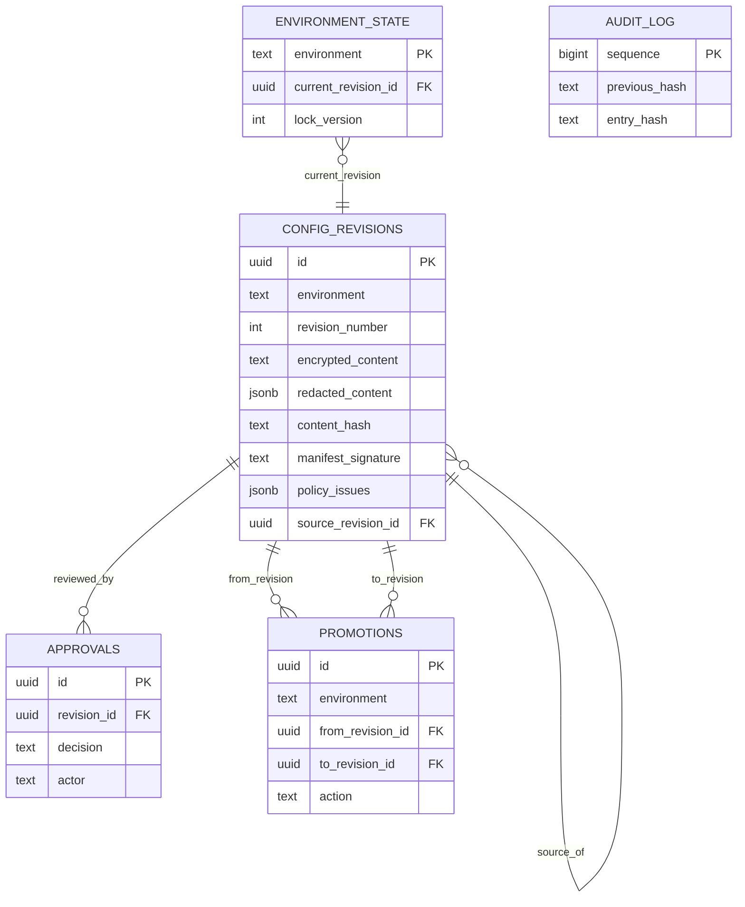

# Architecture and immutability

## Why configurations are immutable

An in-place update destroys evidence. If a row can be overwritten, an operator cannot reliably
answer which values were reviewed, which hash was approved, or what was active during an incident.
This service therefore treats configuration content as immutable. A revision receives an ID,
monotonic per-environment number, normalized content hash, encrypted payload, redacted view, policy
result, author, and creation timestamp exactly once.

Approval never modifies the revision. It appends an approval record. Activation changes only the
environment pointer. Promotion creates a new immutable target-environment revision linked through
`source_revision_id`. Rollback changes the active pointer to an existing historical revision.

## Data model

## Transaction boundaries

- Revision creation obtains a PostgreSQL advisory lock per environment, allocates the next revision
  number, inserts the immutable row, and appends the audit entry in one transaction.
- Activation and rollback lock `environment_state`, compare `lock_version`, update the pointer,
  insert promotion history, and append audit evidence atomically.
- Promotion locks both target revision numbering and target environment state, inserts an approved
  derived revision, changes the pointer, records lineage, and writes audit evidence atomically.
- Audit writes use a dedicated transaction advisory lock so every entry has exactly one predecessor.

## Hash and duplicate semantics

Input is parsed into a typed JSON-compatible value. Object keys are recursively sorted and compactly
serialized before SHA-256 hashing. Formatting, indentation, and YAML/JSON key ordering therefore do
not change identity. `(environment, content_hash)` is unique, so accidental retries produce HTTP 409
instead of duplicate revisions. The same logical content may exist once in each environment because
promotion needs environment-specific policy evidence and signatures.

## Failure behavior

PostgreSQL is the consistency boundary. The readiness endpoint returns 503 when it cannot be reached.
No configuration mutation is acknowledged until its database transaction commits. Failed policy
validation can be stored for review, but a revision containing error findings cannot be approved.
Promotion revalidates decrypted canonical content against target-environment policies before its
transaction starts.
